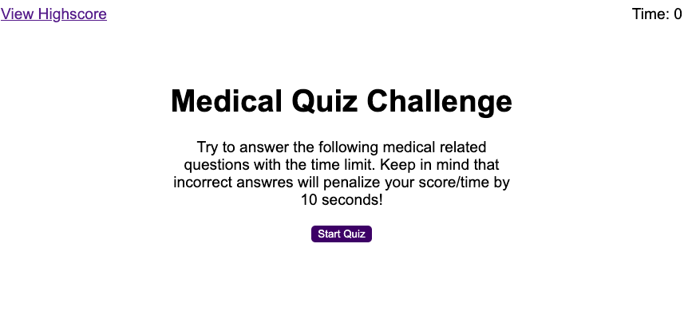

# med-quiz
A timed quiz on medical terminology

# Motivation for this project

learn how to create dynamic interactive web application by creating and manipulating html elements, add event listeners, create timers, and store data using javascript. 

# Reason for this project 

Build a timed Medical quiz with multiple-choice questions that will feature dynamically updated HTML and CSS powered by JavaScript code that runs in the browser and has a responsive user interface.

# What I learned from this project 

In this activity I learnt:

* How to start HW assignemnets; step by step breaking down of the acceptance criteria 

* The importance of stackoverflow when trying to figure out what the inspect mistake made means/wants you to correct

* How implement DOM API methods to handle events like key presses and mouse clicks.

* How to store and retrieve data using the browser's local and session storage.

* How to select and dynamically generate HTML elements and content using Web API methods.

https://conso97.github.io/med-quiz/

